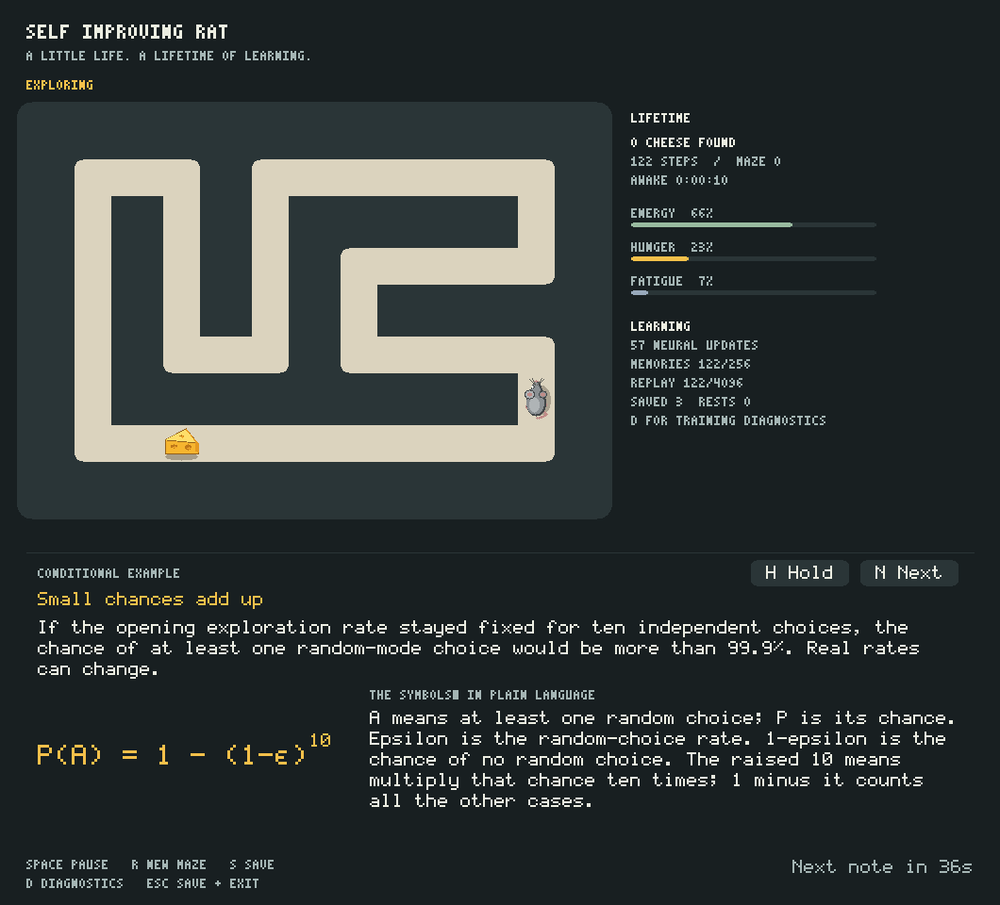

# Self Improving Rat

A persistent artificial-life rat in a procedurally generated maze. The rat is
a recurrent reinforcement-learning agent with a body (homeostasis), a world
model, curiosity, episodic memory, structural plasticity and lifelong
development. It learns online, remembers across sessions, and saves its whole
organism state to disk. No GPU, no ML frameworks, no network — a small,
single-threaded C++20 desktop application with an SDL2 renderer.

**Honest framing.** This project is a self-contained artificial-life study,
not a claim of general intelligence or consciousness. The rat reliably
*attempts* to improve: its parameters change from experience, but **long-term
monotonic intelligence growth is not guaranteed**. Maze navigation with sparse, moving
rewards is hard for the built-in learner; measured behavior is documented in
[How improvement is measured](#how-improvement-is-measured) and in the
test suite.



The September 2026 update adds grey fur, ears, whiskers and a curved tail;
three-faced golden cheese wedges; rounded warm corridors; and an always-visible
learning panel with rotating, plain-language mathematical explanations.
The learner now saves recent replay, reconstructs recurrent
sequences, avoids observed walls and uses episodic action counts to explore.
See [measured results and validation](docs/validation-20260909.md).

---

## Requirements

- Ubuntu (tested on 26.04 LTS), 64-bit
- cmake ≥ 3.16, g++ (C++20), make or ninja
- SDL2 **runtime** (`libSDL2-2.0.so.0`, normally preinstalled) and SDL2
  **development files** (`libsdl2-dev`)

## Run

```bash
./run.sh                 # configure, build, and run the application
./run.sh --test          # build and run the test suite (no SDL needed)
./run.sh --clean         # remove the build directory only
./run.sh --sanitize      # build+run with AddressSanitizer/UBSan
./run.sh --install-deps  # sudo apt-get install libsdl2-dev (opt-in)
```

- If SDL2 dev files are missing, `run.sh` explains what to install
  (`./run.sh --install-deps`, or set `SIR_SDL2_PREFIX` to an extracted
  `libsdl2-dev` .deb tree — used when root is unavailable).
- `./run.sh` never touches `data/checkpoints` or `data/logs`.

Environment hooks (all optional):

| Variable | Effect |
| --- | --- |
| `SIR_CONFIG=PATH` | alternate config file |
| `SIR_SEED=N` | fixed random seed (overrides the config `seed` key) |
| `SIR_HEADLESS=1` | no window; runs the simulation only |
| `SIR_MAX_STEPS=N` | exit cleanly after N simulation steps |
| `SIR_SCREENSHOT=path.bmp` | save one frame after ~30 rendered frames |
| `SIR_SDL2_PREFIX=...` | extracted libsdl2-dev tree for the build |

Example headless verification run:

```bash
SDL_VIDEODRIVER=dummy SIR_MAX_STEPS=2000 SIR_SCREENSHOT=/tmp/rat.bmp ./build/sir
```

## Controls

| Key | Action |
| --- | --- |
| `Space` | pause / resume |
| `R` | regenerate the maze (learned weights are untouched) |
| `S` | save a checkpoint immediately |
| `D` | toggle the diagnostics panel |
| `H` | hold / resume the rotating learning note |
| `N` | show the next learning note (also while held) |
| `Esc` | save and exit |
| window close | save and exit |

`SIGINT`/`SIGTERM` also trigger a clean save-and-exit; a second signal exits
immediately. All checkpoints are written atomically (temp file + fsync +
rename, previous valid checkpoint kept as `.bak`).

The bottom reader shuffles 26 explanations of the actual experiment: Double-DQN,
GRU memory, prioritized replay, burn-in, curiosity, reward shaping, persistence,
and more. Formulas have a plain-language symbol guide; worked probabilities
use the current configuration and the exploration rate when the note opens.
Conditional examples and possible emergent behavior are labeled separately
from observations. The app does not estimate a probability of future mastery.

Notes rotate at a reading-paced interval (24–60 seconds). Click **Hold** or
**Next**, or use `H` / `N`; holding the text is independent of pausing the rat.
Its separate random stream never changes training randomness. The reader uses
an included sentence-case bitmap alphabet and a small LaTeX typesetter, with
no network or additional runtime dependencies. The default window is now
1060×960; smaller requested windows expand to at least 640 pixels wide and
the height needed for readable notes and a compact habitat.

---

## Architecture

```
config ──▶ Application ──▶ Simulation (maze, rat, cheese, body)
             │  │  │
             │  │  └──▶ Agent (GRU + policy/prediction heads, Adam,
             │  │         prioritized replay, episodic memory, novelty,
             │  │         plasticity, consolidation)
             │  └──▶ Metrics (observed statistics only)
             └──▶ CheckpointStore (atomic v3 persistence)
```

- **Simulation** owns the maze, the rat, the cheese and the homeostatic body.
  It is fully deterministic for a fixed seed and the action sequence; it
  never uses pathfinding or privileged information.
- **Agent** owns all learning state and produces the actions.
- **Application** composes the reward from the observation, the simulation
  outcome and the agent's intrinsic signals, then drives training,
  consolidation, autosave and the render loop.
- **Renderer** uses SDL2 software drawing with a dark habitat, warm rounded
  paths, a grey rat and golden cartoon cheese. It needs no textures, external
  assets, GPU or network. The maze fits above a rotating learning reader;
  bitmap fonts label real organism metrics and typeset explanatory formulas.

## Simulation rules

- The maze is generated by an iterative recursive backtracker (a perfect
  maze) followed by optional braiding (opening extra corridors can never
  disconnect it). The border is always wall; every walkable cell is
  reachable from every other (verified by the test suite across many seeds).
- The rat occupies one cell; it may attempt to move one cell per step
  (Up/Down/Left/Right). Moving into a wall fails (collision).
- The cheese sits on a walkable cell at least `min_cheese_distance`
  (manhattan) from the rat; eating it awards a large reward, restores energy,
  reduces hunger, raises satisfaction, and a new cheese is placed. Every
  `maze_regenerate_every_cheeses` cheese collections the whole maze is
  regenerated (weights are untouched).
- The body (homeostasis) changes every step: energy is spent by living and
  moving and restored by cheese; hunger grows and is reduced by cheese;
  fatigue grows with movement and recovers while resting (consolidation) or
  idling; stress rises on collisions (worse when repeated) and falls on
  success and cheese; curiosity need grows and is consumed by novelty; a
  satisfaction trace responds to cheese and reverts toward its baseline; a
  prediction-uncertainty trace follows the world model. All values live in
  `[0,1]` and are updated by deterministic rules driven by real events.

## Observation vector

One base frame has **30 channels, all in `[0,1]`**; the network input is
`30 × observation_frames` (default 1; the GRU provides temporal memory).

```
[0..7]   wall bits of the 8 neighbors: N, NE, E, SE, S, SW, W, NW (1=blocked)
[8..11]  cheese scent, action-aligned: Up, Down, Left, Right (0..1)
         strength = (radius / (dist + radius)) * max(0, dot(dir, offset)/dist)
         per cheese, max over cheeses; walls do not block smell;
         zero beyond the sensory radius (no absolute distance is exposed)
[12..15] last action one-hot: Up, Down, Left, Right
[16]     wall-hit flag of the last action
[17]     revisit signal: 1 - steps_since_last_visit/8 (clamped)
[18]     last reward mapped to [0,1] via (clamp(r,-1,1)+1)/2
[19]     energy
[20]     hunger
[21]     fatigue
[22]     stress
[23]     curiosity need
[24]     satisfaction
[25]     prediction uncertainty
[26]     recent novelty signal (0..1)
[27]     resting flag (1 during consolidation)
[28]     normalized x position (proprioception; the rat's own body state)
[29]     normalized y position (proprioception)
```

No channel carries the maze map, the cheese coordinates, path lengths,
reachability information, or any future state. The two proprioception
channels are the rat's own location (what a real animal knows about its own
body), not hidden maze information; they help distinguish local observations. The environment remains partially
observable because unvisited maze structure is hidden. Pathfinding (BFS) exists only in the maze
module for validation and tests and is never passed to the agent.

## Action space

Four discrete actions: Up, Down, Left, Right. A move into a wall is a failed
move (the rat stays put and earns the wall penalty).

## Reward function

The composite reward each step is (clamped to `[-12, 12]`):

```
r_total = r_navigation                     cheese +10 / wall −0.2 /
                                          step −0.02 / revisit −0.05
        + r_homeostasis                    −e·(1−E) − h·H − f·F − s·S² + sat·(Sat−0.5)
                                          (factors from config, all bounded)
        + r_curiosity                      curiosity_gain · novelty · (0.5+0.5·need)
        + r_prediction                     prediction_gain · (1 − uncertainty)
        + r_scent_potential                scent_gain · (gamma·Phi(next) − Phi(now))
        + r_collapse                       −collapse_penalty when the recent action
                                          entropy is very low and the recent average
                                          reward is negative (contextual anti-collapse)
```

- The navigation reward is returned by the simulation (`reward_nav`); the
  homeostatic reward is computed from the body state after the step; the
  curiosity/prediction terms come from the agent's intrinsic signals.
- `Phi` is the sum of the four scent channels in the newest observation
  frame. It is zero at a cheese terminal. Discounted potential differences
  telescope: standing still or circling cannot earn a continuing proximity
  bonus. The predictive-accuracy reward defaults to zero to avoid rewarding
  easy-to-predict stationary behavior; prediction learning and curiosity remain.
- The world-model prediction target is the **external** reward
  (navigation + homeostatic), not the composite; the composite reward is the
  RL target.

## Network and learning

- **Small on-device network:** 30 inputs, a 16-unit GRU, four Q values and
  16 sigmoid prediction outputs: 2,596 float32 parameters (10.1 KiB of
  weights per network). Online training runs on one CPU thread with reused
  scratch storage. Float32 is retained for online Adam stability; this is
  not an int8 inference deployment or an accelerator benchmark.
- **Double-DQN with correct recurrence:** online and target networks each
  advance the current observation before evaluating the next one. Optional
  1–8-step returns stop at terminal or sequence boundaries. Rest and maze
  changes truncate sequences; nonterminal boundaries retain their bootstrap.
  One-step replay still uses a stored hidden-state anchor, so staleness is
  reduced rather than eliminated.
- **Recurrent sequence learning:** every 32 simulation steps, an eight-step
  chunk trains with backpropagation through time. Up to four preceding
  transitions reconstruct the hidden state without gradients (burn-in).
  Online and target recurrent chains are separate. Consolidation also uses
  sequence batches, within its existing operation budget. Neither burn-in,
  returns nor gradients cross recorded episode boundaries.
- **Tempered prioritized replay:** a preallocated sum tree samples in
  `O(batch × log capacity)` rather than scanning the whole buffer. Priority
  is `clamp(abs(TD error), 0.001, 1000)^alpha`, with `alpha=0.6` by default.
  Stratified samples receive importance weights `(N·P(i))^-beta`, normalized
  within the batch and averaged by batch size. Beta anneals from 0.5 to 1
  over the exploration schedule; zero disables the correction.
- **Exploration with episodic memory:** observed cardinal wall bits mask both
  behavior actions and bootstrap argmaxes. Bounded counts indexed by the
  rat's own position/action add a UCB-style `0.5*sqrt(2*log(2+visits)/(1+action_count))` bonus to
  locally normalized behavior Q values and
  bias random exploration toward less-tried actions. Counts reset at food,
  rest, maze and session boundaries. They never inspect the maze map or food
  coordinates. Frozen greedy evaluation disables both this bonus and random
  exploration, separating learned values from exploration assistance.
- **Stable updates:** Huber TD loss, Adam, global norm clipping, soft target
  updates and finite-input checks. An invalid update cannot contaminate the
  target network. Dormant connections are masked in gradients, optimizer
  moments and updated weights, preventing accidental regrowth.
- **Prediction and curiosity:** the auxiliary head predicts the next 12
  wall/scent channels, three homeostatic deltas and external reward. Novelty
  combines bounded hashed state counts and prediction error. This is an
  auxiliary predictor, not a planner or a full action-conditioned world model.
- **Retained learning:** significant experiences use a bounded episodic
  store; weaker arrivals cannot evict stronger cheese experiences. Connection
  utility uses a persistent exponential moving average. Development keeps
  learning and exploration above configured floors. Consolidation replays
  memories and performs bounded structural updates with instability checks.

These mechanisms adapt [prioritized experience replay](https://arxiv.org/abs/1511.05952)
and [recurrent replay with burn-in](https://willdabney.com/publication/r2d2/)
to this app's small CPU budget. The position/action count bonus is a simple
local exploration mechanism, not a reproduction of NGU or Agent57. There is
no claim to implement the newest or universally best edge RL algorithm.

## Checkpoint persistence

Binary format `SIRCPT03` (reads and migrates existing `SIRCPT02` files) with an FNV-1a64 checksum over the whole payload.
It stores: topology, counters, exploration/optimizer state (Adam moments),
the complete neural parameters (online + target), connection masks and
utility traces, the RNG state, the homeostatic snapshot, the novelty table,
the episodic memory, recent replay transitions, priorities and sequence
boundaries, and lifetime/consolidation/plasticity history. Full default replay
(4,096 transitions) survives a restart. Larger buffers save the newest entries
within an 8 MiB replay snapshot budget. A smaller configured capacity restores
the newest entries that fit. Restart begins a new maze and transient recurrent
context; it is not a bit-for-bit continuation of the simulation world.

Safety properties (all covered by tests):

- atomic writes: temp file → fsync → rename; the previous valid checkpoint is
  kept as `.bak` and is never overwritten before the new file is fully
  written and validated; directory fsync makes the rename durable;
- load order: primary → backup → fresh organism with a clear log; corrupt
  files are renamed `.bad` (legacy v1 files `.legacy-v1`), never silently
  deleted;
- files are size-, length- and finite-checked before allocation and
  restored; truncated, checksum-corrupted, NaN-containing or trailing-garbage
  files are rejected;
- checkpoints with a topology that does not match the current configuration
  are reported as incompatible and preserved (a fresh organism starts; saving
  to that directory is refused so the incompatible organism cannot be overwritten);
- only the two newest checkpoints exist on disk (primary + backup).

## Resource limits

- Single-threaded; no thread or file-descriptor leaks.
- Replay buffer: `replay_capacity` (4096) transitions, preallocated.
- Episodic memory: 256 entries. Novelty table: 1024 slots (counts halve when
  full). Metrics: fixed rolling windows.
- Log: size-rotated at `log_max_bytes`, at most two files.
- Simulation is capped at `sim_steps_per_second` with bounded catch-up per
  frame (`max_catchup_steps_per_frame`); rendering is capped at
  `render_frames_per_second`; training happens every `train_interval_steps`
  with fixed batch size; consolidation work is capped per cycle. No
  busy-wait loops; the frame loop sleeps.
- The full default replay snapshot is about 1.31 MiB. See the current
  benchmark CSV for measured peak resident memory and CPU time. Increasing
  configured model, maze or buffer sizes increases resource use.

## Configuration

`config/default.cfg` documents every key. All values have safe built-in
defaults, so a missing or partial file still starts the application (missing
file → warning, defaults; invalid keys/values → warnings). Ranges are
clamped on load. Notable groups: window/render, simulation (maze size,
braiding, cheese distance, scent radius), navigation rewards, learning
(GRU size, learning rate, discount, exploration, replay, batch), organism
(homeostasis rates, reward composition, prediction/curiosity, episodic
capacity, development, consolidation, structural plasticity), persistence
(autosave interval, paths, log size), and the random seed.

The shipped defaults are chosen for **learnability**: a 13×9 maze with heavy
braiding, a scent radius that covers the maze, a small minimum cheese
distance, potential-based scent shaping, prioritized replay and per-2-step
training. Larger mazes are supported (`maze_width/height` up to 199) but are
harder for the learner; see Known limitations.

## How improvement is measured

- The test suite asserts the learning machinery: parameters change after
  training and do not change while only observing; the policy learns a toy
  reward task even against the argmax tie-break; gradients match
  finite-difference checks; rewards enter the update; NaN updates are
  rejected; exploration and exploitation both function.
- A full integration run (agent + simulation, headless, deterministic) is
  part of the tests; the rat finds cheese, consolidation runs, and all state
  stays bounded.
- **Matched online benchmark:** 100,000 simulation steps per seed, seeds
  `1 2 3 42 12345`, fresh checkpoints, unchanged maze difficulty. Before this
  update: 186 cheeses total (mean 37.2). Updated behavior: 1,167 total (mean
  233.4), **6.27×** the collections. This compares the whole system, including
  wall masks, exploration and learning; it does not isolate neural learning.
- **Frozen evaluation:** `sir_eval` evaluates saved weights on fresh seeds
  with training disabled, alongside a legal random walk and an untrained
  network with the same memory-assisted exploration. It also reports greedy
  learned behavior with exploration disabled. See the linked validation
  report for results and limitations; online reward alone is not evidence of
  reliable generalization.

```bash
TAG=my_run KEEP_RUNS=/tmp/rat-evaluation tools/bench.sh 100000 1 2 3 42 12345
# Use one of the retained configuration paths printed by the benchmark:
./build-bench/sir_eval /tmp/rat-evaluation/seed-1-XXXXXX/config.cfg 5000 1001 10
```

## Known limitations

- **Maze navigation is hard for the built-in learner.** With sparse, moving
  rewards (the cheese is re-placed on every collection), Q-learning with a
  small GRU adapts slowly; the shipped defaults keep the task learnable but
  the learned greedy policy can still stall, and exploration remains essential. Long-horizon
  navigation in large mazes (e.g. 47×31) is not reliably learned within
  practical run times — this is a documented consequence of the local
  perception and sparse-reward design, not a hidden mechanism.
- **No guaranteed intelligence growth.** The system guarantees persistent
  adaptation attempts and bounded, verified learning dynamics — not
  monotonic improvement.
- **No consciousness or sentience claims.** The homeostatic variables,
  curiosity and "satisfaction" are deterministic numeric state, not feelings.
- **Cross-platform determinism** is not guaranteed (RNG and float
  arithmetic); determinism is asserted within one platform/build.
- **Two stacked observation frames** (configurable 1–4) are supported but
  the default is 1; the GRU provides the temporal memory.

## Testing

`./run.sh --test` builds and runs `sir_tests` (no SDL required). The suite
covers: maze validity/connectivity across seeds, collision handling,
observation shape/bounds/no-cheating properties, GRU + network
finite-difference gradients, parameter updates, toy-MDP learning, NaN
rejection, exploration/exploitation, replay wraparound and prioritization,
episodic capacity/replacement/serialization, novelty decay and bounds,
homeostasis bounds and event effects, development schedules, checkpoint
round-trips, corruption/checksum/NaN/trailing-garbage rejection, backup
fallback, incompatible-topology handling, deterministic seeds, plasticity
hard limits and mask round-trips, consolidation op bounds, long-run
boundedness, and learning-integration cheese finding. The suite is also run
under AddressSanitizer + UndefinedBehaviorSanitizer.

`ctest --test-dir build --output-on-failure` also runs the actual SDL renderer
with a dummy video driver. Reader checks cover shuffled rotation, hold/resume,
keyboard and mouse controls, all 26 notes, narrow layouts, mathematical glyphs,
probability examples and independence from simulation randomness.
